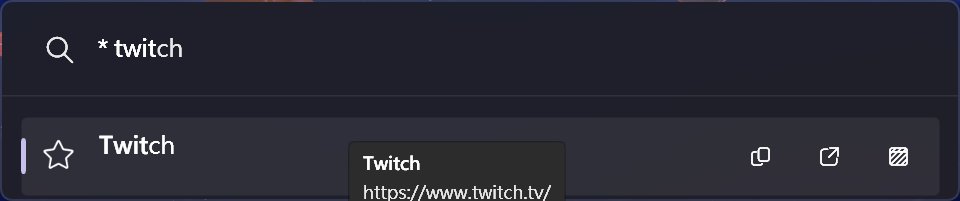
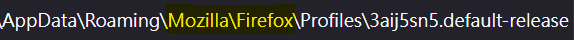

# Firefox bookmark Plugin for PowerToys Run

[PowerToys Run](https://aka.ms/PowerToysOverview_PowerToysRun) plugin for opening bookmarks in Firefox based browser like zen.

Checkout the [Template](https://github.com/8LWXpg/PowerToysRun-PluginTemplate) for a starting point to create your own plugin.

## Features

### Open bookmark



## Settings

### Path to "Profiles" folder

The path after `%APPDATA%` and before `Profiles`, check about:profiles in browser.



**Default:** `Mozilla\Firefox`

### Browser name

The name that can be found by Windows shell <kbd>Win+R</kbd>.

**Default:** `firefox`

## Installation

### Manual

1. Download the latest release of the from the releases page.
2. Extract the zip file's contents to `%LocalAppData%\Microsoft\PowerToys\PowerToys Run\Plugins`
3. Restart PowerToys.

### Via [ptr](https://github.com/8LWXpg/ptr)

```shell
ptr add FirefoxBookmark 8LWXpg/PowerToysRun-FirefoxBookmark
```

## Usage

1. Open PowerToys Run (default shortcut is <kbd>Alt+Space</kbd>).
1. Type `*`.

## Building

1. run `dotnet build -c Release`.

## Debugging

1. Build the project in `Debug` configuration.
1. Make sure you have [gsudo](https://github.com/gerardog/gsudo) installed in the path.
1. Run `debug.ps1` (change `$ptPath` if you have PowerToys installed in a different location).
1. Attach to the `PowerToys.PowerLauncher` process in Visual Studio.

## Contributing

### Localization

If you want to help localize this plugin, please check the [localization guide](./Localizing.md)
